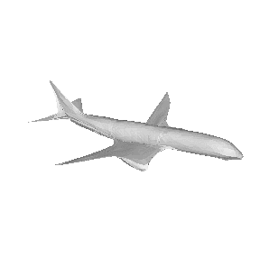
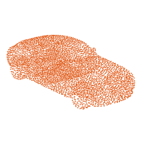

<br />
<a href="https://github.com/finos/perspective/blob/master/docs/static/svg/perspective-logo-light.svg?raw=true#gh-light-mode-only"></a>
<a href="https://github.com/finos/perspective/blob/master/docs/static/svg/perspective-logo-dark.svg?raw=true#gh-dark-mode-only"></a>
<br/><br/>

[](https://www.npmjs.com/package/@finos/perspective)
[](https://pypi.python.org/pypi/perspective-python)
[](https://crates.io/crates/perspective)
[](https://github.com/finos/perspective/actions/workflows/build.yaml)

<br/>

Perspective is an <i>interactive</i> analytics and data visualization component,
which is especially well-suited for <i>large</i> and/or <i>streaming</i>
datasets. Use it to create user-configurable reports, dashboards, notebooks and
applications, then deploy stand-alone in the browser, or in concert with Python
and/or [Jupyterlab](https://jupyterlab.readthedocs.io/en/stable/).

### Features

-   A fast, memory efficient streaming query engine, written in
    C++ and compiled for both [WebAssembly](https://webassembly.org/) and
    [Python](https://www.python.org/), with read/write/streaming for
    [Apache Arrow](https://arrow.apache.org/), and a high-performance columnar
    expression language based on [ExprTK](https://github.com/ArashPartow/exprtk).

-   A framework-agnostic User Interface packaged as a
    [Custom Element](https://developer.mozilla.org/en-US/docs/Web/Web_Components/Using_custom_elements),
    powered either in-browser via WebAssembly or virtually via
    WebSocket server (Python/Node).

-   A [JupyterLab](https://jupyter.org/) widget and Python client library, for
    interactive data analysis in a notebook, as well as _scalable_ production
    [Voila](https://github.com/voila-dashboards/voila) applications.

### Examples

<!-- Examples -->
<table><tbody><tr><td>editable</td><td>file</td><td>fractal</td></tr><tr><td><a href="https://perspective.finos.org/block?example=editable"></img></a></td><td><a href="https://perspective.finos.org/block?example=file"></img></a></td><td><a href="https://perspective.finos.org/block?example=fractal"></img></a></td></tr><tr><td>market</td><td>raycasting</td><td>evictions</td></tr><tr><td><a href="https://perspective.finos.org/block?example=market"></img></a></td><td><a href="https://perspective.finos.org/block?example=raycasting"></img></a></td><td><a href="https://perspective.finos.org/block?example=evictions"></img></a></td></tr><tr><td>nypd</td><td>magic</td><td>streaming</td></tr><tr><td><a href="https://perspective.finos.org/block?example=nypd"></img></a></td><td><a href="https://perspective.finos.org/block?example=magic"></img></a></td><td><a href="https://perspective.finos.org/block?example=streaming"></img></a></td></tr><tr><td>covid</td><td>webcam</td><td>movies</td></tr><tr><td><a href="https://perspective.finos.org/block?example=covid"></img></a></td><td><a href="https://perspective.finos.org/block?example=webcam"></img></a></td><td><a href="https://perspective.finos.org/block?example=movies"></img></a></td></tr><tr><td>superstore</td><td>citibike</td><td>olympics</td></tr><tr><td><a href="https://perspective.finos.org/block?example=superstore"></img></a></td><td><a href="https://perspective.finos.org/block?example=citibike"></img></a></td><td><a href="https://perspective.finos.org/block?example=olympics"></img></a></td></tr><tr><td>jupyterlab</td></tr><tr><td><a href="http://beta.mybinder.org/v2/gh/finos/perspective/master?urlpath=lab/tree/examples/jupyter-notebooks"></img></a></td></tr></tbody></table>
<!-- Examples -->

### Documentation

-   [Project Site](https://perspective.finos.org/)
-   User Guides
    -   [Javascript User Guide](https://perspective.finos.org/docs/js.html)
    -   [Python User Guide](https://perspective.finos.org/docs/python.html)
    -   [Developer Guide](https://perspective.finos.org/docs/development.html)
-   Concepts
    -   [Table](https://perspective.finos.org/docs/table.html)
    -   [View](https://perspective.finos.org/docs/view.html)
    -   [Expression Columns](https://perspective.finos.org/docs/expressions.html)
    -   [Data Binding](https://perspective.finos.org/docs/table.html)
-   API
    -   [Perspective API](https://github.com/finos/perspective/blob/master/packages/perspective/README.md)
    -   [Perspective Viewer API](https://perspective.finos.org/docs/obj/perspective-viewer/)
    -   [Perspective Python API](https://perspective.finos.org/docs/obj/perspective-python.html)

### Community / Media

-   [Streaming, cross-sectional data visualization in JupyterLab | Junyuan Tan, JupyterCon 2020](http://www.youtube.com/watch?v=IO-HJsGdleE)
-   [Perspective in 3D | Andrew Stein, Open Source in Finance Forum NYC 2022](https://www.youtube.com/watch?v=0ut-ynvBpGI)
-   [Build an order book simulation with Perspective | Andrew Stein, FINOS Open Source in Fintech Meetup 2021](https://www.youtube.com/watch?v=no0qChjvdgQ)
-   [Perspective project case study | FINOS](https://www.finos.org/hubfs/FINOS/assets/FINOS%20Perspective%20Case%20Study.pdf)


# Blockchain Asset Tracking
A supply chain consists of many different participants exchanging goods, services, and payments. It is often desirable to track the physical assets digitally to be informed about the whereabouts, to trigger processes, certify the ownership, and perform corresponding payments.

The main four functions of this supply chain managment implementation is "Create Asset" , "Transfer Asset" ,"Search Asset" and "Delete Asset". also some minor functionalities include an event history of the four main functions and a login/signup/logout pages.

## Screenshots
### View Assets


### Create Asset


### Transfer Asset


### Delete Asset


### Search Asset


## Getting Started
### Prequisites
  - PHP
  - XAMPP
  - Web3JS
  - MetaMask
  - Visual Studio Code "any IDE would do the trick"
  - Google Chrome " any Browser would do the trick too"

### Run
#### Install and Setup MetaMask
go to [MetaMask](https://metamask.io/download.html) to download the extention and create an account. Switch to Rinkebey Test Network and Deposite some Ether "Go to Test Faucet and hit Get Ether". Then go to Crypto Faucet and follow the instructions.

#### XAMPP
start XAMPP Apache server and MySQL and go to http://localhost/blockchain/index.html. Don't forget to move the files to xampp/htdocs/blockchain to not get an error!.

#### Remix Ethereum
If you want to edit the .sol Contracts you need to go to [Remix Ethereum](https://remix.ethereum.org/) . switch to Solidity enviroment and create two .sol files. AssetTracker.sol and AssetLibrary.sol, Then copy the content of the contracts from this git repo into the .sol files. don't forget to compile each file first. Then in the Deploy tab switch to Injected Web3 enviroment and hit Deploy.
To use your edited contracts in the repo go to js/ether_config.js and edit the address and abi variables. you can get the address from the deploy tab and the abi from the complie tab. "Do I need to tell you everything?"

## Authors
Me

## License
Free

## Acknowledgment
Big thanks to [ ilavisharma ](https://github.com/ilavisharma/Asset-Tracker-Blockchain) for providing the base code and contracts.


# Pixel2Mesh
This repository contains the TensorFlow implementation for the following paper</br>

[Pixel2Mesh: Generating 3D Mesh Models from Single RGB Images (ECCV2018)](http://openaccess.thecvf.com/content_ECCV_2018/papers/Nanyang_Wang_Pixel2Mesh_Generating_3D_ECCV_2018_paper.pdf)</br>

Nanyang Wang, [Yinda Zhang](http://robots.princeton.edu/people/yindaz/), [Zhuwen Li](http://www.lizhuwen.com/), [Yanwei Fu](http://yanweifu.github.io/), [Wei Liu](http://www.ee.columbia.edu/~wliu/), [Yu-Gang Jiang](http://www.yugangjiang.info/).

#### Citation
If you use this code for your research, please consider citing:

    @inProceedings{wang2018pixel2mesh,
      title={Pixel2Mesh: Generating 3D Mesh Models from Single RGB Images},
      author={Nanyang Wang and Yinda Zhang and Zhuwen Li and Yanwei Fu and Wei Liu and Yu-Gang Jiang},
      booktitle={ECCV},
      year={2018}
    }

# Try it on Colab

Installing all the dependencies might be tricky and you need a computer with a CUDA enabled GPU. To get started fast you can just try [this](https://colab.research.google.com/drive/13xkSkvPaF5GU6Wpf35nVHUdP77oBVHlT#scrollTo=xXxbMrF4fdZs) demo developed by [Mathias Gatti](https://github.com/mathigatti) using Google Colab.

[](https://colab.research.google.com/drive/13xkSkvPaF5GU6Wpf35nVHUdP77oBVHlT#scrollTo=xXxbMrF4fdZs)


# Project Page
The project page is available at https://nywang16.github.io/p2m/index.html

# Dependencies
Requirements:
* Python2.7+ with Numpy and scikit-image
* [Tensorflow (version 1.0+)](https://www.tensorflow.org/install/)
* [TFLearn](http://tflearn.org/installation/)

Our code has been tested with Python 2.7, **TensorFlow 1.3.0**, TFLearn 0.3.2, CUDA 8.0 on Ubuntu 14.04.

# News
- Nov. 8, we update the script for generate auxiliary data.

# Running the demo
```
git clone https://github.com/nywang16/Pixel2Mesh.git
cd Data/
```
Download the pre-trained model and unzip to the `Data/` folder.
* https://drive.google.com/file/d/1gD-dk-XrAa5mfrgdZSunjaS6pUUWsZgU/view?usp=sharing
```
unzip checkpoint.zip
```

#### Reconstructing shapes
    python demo.py --image Data/examples/plane.png
Run the demo code and the output mesh file is saved in `Data/examples/plane.obj` 

#### Input image, output mesh


# Installation

If you use CD and EMD for training or evaluation, we have included the cuda implementations of [Fan et. al.](https://github.com/fanhqme/PointSetGeneration) in external/

    cd Pixel2Mesh/external/

    Modify the first 3 lines of the makefile to point to your nvcc, cudalib and tensorflow library.

    make


# Dataset

We used the [ShapeNet](https://www.shapenet.org) dataset for 3D models, and rendered views from [3D-R2N2](https://github.com/chrischoy/3D-R2N2):</br>
When using the provided data make sure to respect the shapenet [license](https://shapenet.org/terms).

Below is the complete set of training data. Download it into the `Data/` folder.

https://drive.google.com/open?id=131dH36qXCabym1JjSmEpSQZg4dmZVQid </br>


The training/testing split can be found in `Data/train_list.txt` and `Data/test_list.txt` </br>
    
Each .dat file in the provided data contain: </br>
* The sampled point cloud (with vertex normal) from ShapeNet. We transformed it to corresponding coordinates in camera coordinate based on camera parameters from the Rendering Dataset.

**Input image, ground truth point cloud.**</br>



# Training
    python train.py
You can change the training data, learning rate and other parameters by editing `train.py`

The total number of training epoch is 30; the learning rate is initialized as 3e-5 and drops to 1e-5 after 25 epochs.

# Evaluation
The evaluation code was released, please refer to `eval_testset.py` for more details.

Notice that the 3D shape are downscaled by a factor of 0.57 to generate rendering. As result, all the numbers shown in experiments used 0.57xRaw Shape for evaluation. This scale may be related to the render proccess, we used the rendering data from 3DR2N2 paper, and this scale was there since then for reason that we don't know.

# Statement
This software is for research purpose only. </br>
Please contact us for the licence of commercial purposes. All rights are preserved.

# Contact
Nanyang Wang (nywang16 AT fudan.edu.cn)

Yinda Zhang (yindaz AT cs.princeton.edu)

Zhuwen Li (lzhuwen AT gmail.com)

Yanwei Fu (yanweifu AT fudan.edu.cn)

Yu-Gang Jiang (ygj AT fudan.edu.cn)

# License
Apache License version 2.0

