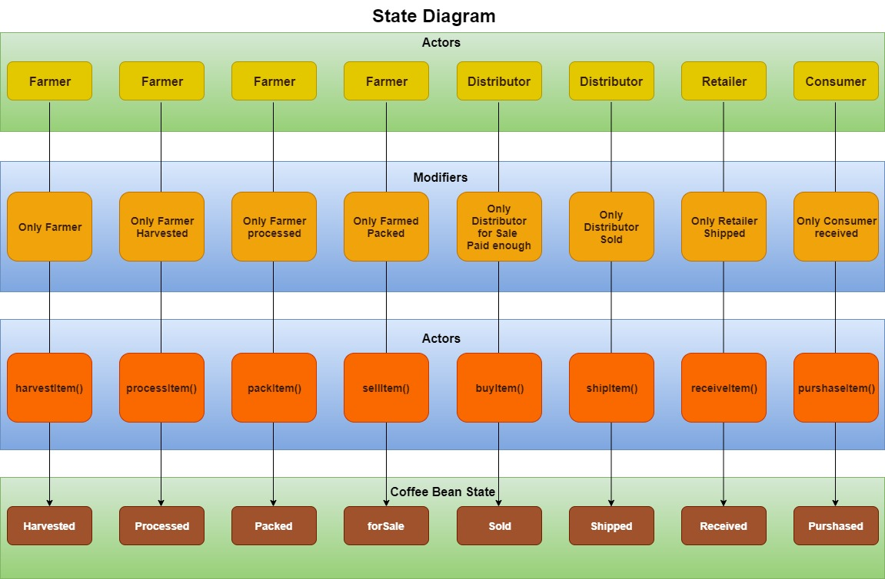

<br />
<a href="https://github.com/finos/perspective/blob/master/docs/static/svg/perspective-logo-light.svg?raw=true#gh-light-mode-only"></a>
<a href="https://github.com/finos/perspective/blob/master/docs/static/svg/perspective-logo-dark.svg?raw=true#gh-dark-mode-only"></a>
<br/><br/>

[](https://www.npmjs.com/package/@finos/perspective)
[](https://pypi.python.org/pypi/perspective-python)
[](https://crates.io/crates/perspective)
[](https://github.com/finos/perspective/actions/workflows/build.yaml)

<br/>

Perspective is an <i>interactive</i> analytics and data visualization component,
which is especially well-suited for <i>large</i> and/or <i>streaming</i>
datasets. Use it to create user-configurable reports, dashboards, notebooks and
applications, then deploy stand-alone in the browser, or in concert with Python
and/or [Jupyterlab](https://jupyterlab.readthedocs.io/en/stable/).


### Examples

<!-- Examples -->
<table><tbody><tr><td>editable</td><td>file</td><td>fractal</td></tr><tr><td><a href="https://perspective.finos.org/block?example=editable"></img></a></td><td><a href="https://perspective.finos.org/block?example=file"></img></a></td><td><a href="https://perspective.finos.org/block?example=fractal"></img></a></td></tr><tr><td>market</td><td>raycasting</td><td>evictions</td></tr><tr><td><a href="https://perspective.finos.org/block?example=market"></img></a></td><td><a href="https://perspective.finos.org/block?example=raycasting"></img></a></td><td><a href="https://perspective.finos.org/block?example=evictions"></img></a></td></tr><tr><td>nypd</td><td>magic</td><td>streaming</td></tr><tr><td><a href="https://perspective.finos.org/block?example=nypd"></img></a></td><td><a href="https://perspective.finos.org/block?example=magic"></img></a></td><td><a href="https://perspective.finos.org/block?example=streaming"></img></a></td></tr><tr><td>covid</td><td>webcam</td><td>movies</td></tr><tr><td><a href="https://perspective.finos.org/block?example=covid"></img></a></td><td><a href="https://perspective.finos.org/block?example=webcam"></img></a></td><td><a href="https://perspective.finos.org/block?example=movies"></img></a></td></tr><tr><td>superstore</td><td>citibike</td><td>olympics</td></tr><tr><td><a href="https://perspective.finos.org/block?example=superstore"></img></a></td><td><a href="https://perspective.finos.org/block?example=citibike"></img></a></td><td><a href="https://perspective.finos.org/block?example=olympics"></img></a></td></tr><tr><td>jupyterlab</td></tr><tr><td><a href="http://beta.mybinder.org/v2/gh/finos/perspective/master?urlpath=lab/tree/examples/jupyter-notebooks"></img></a></td></tr></tbody></table>
<!-- Examples -->


# Pixel2Mesh
This repository contains the TensorFlow implementation for the following paper</br>

[Pixel2Mesh: Generating 3D Mesh Models from Single RGB Images (ECCV2018)](http://openaccess.thecvf.com/content_ECCV_2018/papers/Nanyang_Wang_Pixel2Mesh_Generating_3D_ECCV_2018_paper.pdf)</br>

Nanyang Wang, [Yinda Zhang](http://robots.princeton.edu/people/yindaz/), [Zhuwen Li](http://www.lizhuwen.com/), [Yanwei Fu](http://yanweifu.github.io/), [Wei Liu](http://www.ee.columbia.edu/~wliu/), [Yu-Gang Jiang](http://www.yugangjiang.info/).

#### Citation
If you use this code for your research, please consider citing:

    @inProceedings{wang2018pixel2mesh,
      title={Pixel2Mesh: Generating 3D Mesh Models from Single RGB Images},
      author={Nanyang Wang and Yinda Zhang and Zhuwen Li and Yanwei Fu and Wei Liu and Yu-Gang Jiang},
      booktitle={ECCV},
      year={2018}
    }

# Try it on Colab

Installing all the dependencies might be tricky and you need a computer with a CUDA enabled GPU. To get started fast you can just try [this](https://colab.research.google.com/drive/13xkSkvPaF5GU6Wpf35nVHUdP77oBVHlT#scrollTo=xXxbMrF4fdZs) demo developed by [Mathias Gatti](https://github.com/mathigatti) using Google Colab.

[](https://colab.research.google.com/drive/13xkSkvPaF5GU6Wpf35nVHUdP77oBVHlT#scrollTo=xXxbMrF4fdZs)


Our code has been tested with Python 2.7, **TensorFlow 1.3.0**, TFLearn 0.3.2, CUDA 8.0 on Ubuntu 14.04.

# News
- Nov. 8, we update the script for generate auxiliary data.

# Running the demo
```
git clone https://github.com/nywang16/Pixel2Mesh.git
cd Data/
```
Download the pre-trained model and unzip to the `Data/` folder.
* https://drive.google.com/file/d/1gD-dk-XrAa5mfrgdZSunjaS6pUUWsZgU/view?usp=sharing
```
unzip checkpoint.zip
```

#### Reconstructing shapes
    python demo.py --image Data/examples/plane.png
Run the demo code and the output mesh file is saved in `Data/examples/plane.obj` 

#### Input image, output mesh


# Dataset

We used the [ShapeNet](https://www.shapenet.org) dataset for 3D models, and rendered views from [3D-R2N2](https://github.com/chrischoy/3D-R2N2):</br>
When using the provided data make sure to respect the shapenet [license](https://shapenet.org/terms).

Below is the complete set of training data. Download it into the `Data/` folder.

https://drive.google.com/open?id=131dH36qXCabym1JjSmEpSQZg4dmZVQid </br>


The training/testing split can be found in `Data/train_list.txt` and `Data/test_list.txt` </br>
    
Each .dat file in the provided data contain: </br>
* The sampled point cloud (with vertex normal) from ShapeNet. We transformed it to corresponding coordinates in camera coordinate based on camera parameters from the Rendering Dataset.

**Input image, ground truth point cloud.**</br>


# Training
    python train.py
You can change the training data, learning rate and other parameters by editing `train.py`

The total number of training epoch is 30; the learning rate is initialized as 3e-5 and drops to 1e-5 after 25 epochs.

# Evaluation
The evaluation code was released, please refer to `eval_testset.py` for more details.

Notice that the 3D shape are downscaled by a factor of 0.57 to generate rendering. As result, all the numbers shown in experiments used 0.57xRaw Shape for evaluation. This scale may be related to the render proccess, we used the rendering data from 3DR2N2 paper, and this scale was there since then for reason that we don't know.


# Blockchain Asset Tracking
A supply chain consists of many different participants exchanging goods, services, and payments. It is often desirable to track the physical assets digitally to be informed about the whereabouts, to trigger processes, certify the ownership, and perform corresponding payments.

The main four functions of this supply chain managment implementation is "Create Asset" , "Transfer Asset" ,"Search Asset" and "Delete Asset". also some minor functionalities include an event history of the four main functions and a login/signup/logout pages.

## Screenshots
### View Assets


### Create Asset


### Transfer Asset


### Delete Asset


### Search Asset


# Blockchain Developer Nanodegree project 3 (Supply chain )
This repository containts an Ethereum DApp that demonstrates a Supply Chain flow between a Seller and Buyer. The user story is similar to any commonly used supply chain process. A Seller can add items to the inventory system stored in the blockchain. A Buyer can purchase such items from the inventory system. Additionally a Seller can mark an item as Shipped, and similarly a Buyer can mark an item as Received.

## Project write-up - UML

### Activity


### Sequence


### State


### Classes (Data Model)


## Project write-up - Libraries
The `Roles` library was used by different access control contracts for easy add and remove in the supply chain 
`truffle-hd-wallet-provider` to sign transactions for addresses.

## IPFS
IPFS is not used in this project

## Program Versions numbers
Node: v10.15.3
Solidity: v0.4.24
Truffle: v5.0.25
Web3.js: v1.0.0-beta37 

## Contract address on the Rinkeby test network (Etherscan):
https://rinkeby.etherscan.io/address/0x1d4396d3dfdfffb57e2ae580f175e7dfcf08759a

## Transaction ID and contract address

======================
> Network name:    'rinkeby'
> Network id:      4
> Block gas limit: 0x989677


1_initial_migration.js
======================

   Deploying 'Migrations'
   ----------------------
   > transaction hash:    0x1a02bb12fc80417e2ad1bd56250775110126d74e48fbb03041ae98b24ff92052
   > Blocks: 1            Seconds: 21
   > contract address:    0x302cfAe2e65F6651f3fDB5fAe6f635ca62CA567b
   > block number:        5625069
   > block timestamp:     1576515319
   > account:             0x1D4396D3DfdFFFB57e2Ae580f175E7DFCf08759A
   > balance:             0.97167573
   > gas used:            238594
   > gas price:           10 gwei
   > value sent:          0 ETH
   > total cost:          0.00238594 ETH


   > Saving migration to chain.
   > Saving artifacts
   -------------------------------------
   > Total cost:          0.00238594 ETH


2_deploy_contracts.js
=====================

   Deploying 'FarmerRole'
   ----------------------
   > transaction hash:    0x79b84bba9672baeb0181fa97016e03510903903052a19f4a4a6f0168627ef9ca
   > Blocks: 1            Seconds: 12
   > contract address:    0xa041c902B5E6a8a83c9A3cf6D55C65183eb2462f
   > block number:        5625071
   > block timestamp:     1576515349
   > account:             0x1D4396D3DfdFFFB57e2Ae580f175E7DFCf08759A
   > balance:             0.96674205
   > gas used:            451020
   > gas price:           10 gwei
   > value sent:          0 ETH
   > total cost:          0.0045102 ETH


   Deploying 'DistributorRole'
   ---------------------------
   > transaction hash:    0xf245353475ad170ce060d54680cb2003f8abf9ecdef52db245791b3ca9f79b41
   > Blocks: 0            Seconds: 9
   > contract address:    0xaf1624F9BA8972070eE42311684BE921000355b1
   > block number:        5625072
   > block timestamp:     1576515364
   > account:             0x1D4396D3DfdFFFB57e2Ae580f175E7DFCf08759A
   > balance:             0.96223113
   > gas used:            451092
   > gas price:           10 gwei
   > value sent:          0 ETH
   > total cost:          0.00451092 ETH


   Deploying 'RetailerRole'
   ------------------------
   > transaction hash:    0xec3342fef968e5791df950cf6e1ba8b037d348b11f26e8f5a58f2cb41e6523fe
   > Blocks: 0            Seconds: 9
   > contract address:    0xaf4Cb7bb1ED23FA76f18E34261BE81584Bc6c792
   > block number:        5625073
   > block timestamp:     1576515379
   > account:             0x1D4396D3DfdFFFB57e2Ae580f175E7DFCf08759A
   > balance:             0.95772033
   > gas used:            451080
   > gas price:           10 gwei
   > value sent:          0 ETH
   > total cost:          0.0045108 ETH


   Deploying 'ConsumerRole'
   ------------------------
   > transaction hash:    0x0346a0f1176aacbc2f70d695d25d3ff0bc2b2c5b7b29257e530a3c63510a595a
   > Blocks: 0            Seconds: 7
   > contract address:    0x59Fb032D660d3830Ec24729D6A57286c8Cef0dd8
   > block number:        5625074
   > block timestamp:     1576515394
   > account:             0x1D4396D3DfdFFFB57e2Ae580f175E7DFCf08759A
   > balance:             0.95320977
   > gas used:            451056
   > gas price:           10 gwei
   > value sent:          0 ETH
   > total cost:          0.00451056 ETH


   Deploying 'SupplyChain'
   -----------------------
   > transaction hash:    0x33d25ff003526fa072304b4fcb2921d8e160c37b3cd70292d6a842cf6cecbb49
   > Blocks: 1            Seconds: 10
   > contract address:    0x66c0486577009EC26A9429B1E38657Ba0fa5c2B0
   > block number:        5625075
   > block timestamp:     1576515409
   > account:             0x1D4396D3DfdFFFB57e2Ae580f175E7DFCf08759A
   > balance:             0.92025103
   > gas used:            3295874
   > gas price:           10 gwei
   > value sent:          0 ETH
   > total cost:          0.03295874 ETH


   > Saving migration to chain.
   > Saving artifacts
   -------------------------------------
   > Total cost:          0.05100122 ETH


Summary
=======
> Total deployments:   6
> Final cost:          0.05338716 ETH


